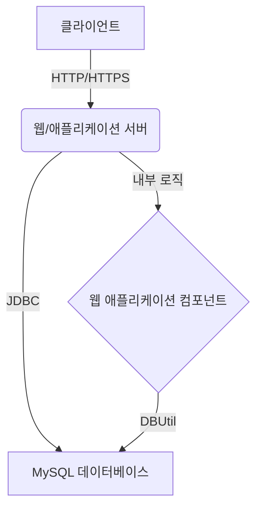

# 시스템 아키텍처 설계서 (Architecture Design)

## 1. 개요

본 문서는 '3jo-tajo' 프로젝트의 시스템 아키텍처를 정의한다. 프로젝트는 Java 기반의 웹 애플리케이션으로, 서블릿 컨테이너 환경에서 동작하며 MySQL 데이터베이스를 활용한다.

## 2. 컴포넌트 및 컨테이너 위상 (Component and Container Topology)

### 2.1 주요 컴포넌트

*   **웹 애플리케이션 (Web Application):** 사용자 요청을 처리하고 비즈니스 로직을 수행하는 핵심 애플리케이션. 서블릿, JSP, Java 클래스 등으로 구성된다.
*   **데이터베이스 유틸리티 (DBUtil):** 데이터베이스 연결 및 관리를 담당하는 유틸리티 클래스.
*   **외부 라이브러리:**
    *   `cos.jar`: 파일 업로드/다운로드 처리 (추정)
    *   `gson-2.10.1.jar`: JSON 데이터 처리
    *   `json-simple-1.1.1.jar`: JSON 데이터 처리
    *   `mysql-connector-j-9.2.0.jar`: MySQL 데이터베이스 연결 드라이버

### 2.2 컨테이너 위상

프로젝트는 표준 서블릿 컨테이너(예: Apache Tomcat) 위에서 동작하는 단일 모놀리식 애플리케이션으로 구성된다. 웹 애플리케이션은 `WEB-INF` 디렉토리 구조를 가지며, 컨테이너에 의해 배포되고 실행된다.

## 3. 인프라 구성 (Infrastructure Configuration)

개발 환경에서는 단일 서버에 웹/애플리케이션 서버와 MySQL 데이터베이스가 함께 설치되는 구성을 가정한다. 운영 환경에서는 트래픽 및 부하에 따라 웹/애플리케이션 서버와 데이터베이스 서버를 분리하거나, 로드 밸런싱 및 클러스터링을 통해 확장할 수 있다.

*   **웹/애플리케이션 서버:** 서블릿 컨테이너 (예: Apache Tomcat)
*   **데이터베이스 서버:** MySQL (HMC_SCM 데이터베이스 사용)

## 4. 분산 처리 및 보안 전략 (Distributed Processing and Security Strategy)

### 4.1 분산 처리

현재 프로젝트 구조는 분산 처리를 위한 명시적인 설계 요소를 포함하고 있지 않다. 단일 모놀리식 애플리케이션으로 동작하며, 필요시 향후 마이크로서비스 아키텍처로의 전환 또는 로드 밸런서를 통한 수평 확장을 고려할 수 있다.

### 4.2 보안 전략

제공된 파일만으로는 구체적인 보안 전략을 파악하기 어렵다. 일반적인 웹 애플리케이션 보안을 위해 다음 사항들을 고려해야 한다.

*   **전송 계층 보안:** HTTPS를 통한 통신 암호화.
*   **입력값 유효성 검증:** SQL Injection, XSS(Cross-Site Scripting) 등 웹 취약점 방지를 위한 모든 사용자 입력값 검증.
*   **인증 및 권한 부여:** 사용자 인증 및 역할 기반 접근 제어 구현.
*   **데이터베이스 보안:** 데이터베이스 접근 제어, 민감 데이터 암호화.
*   **세션 관리:** 안전한 세션 관리 및 세션 하이재킹 방지.

---

**파일명:** `3jo-tajo_ArchitectureDesign_v1.0_260602.md`
**작성일:** 2026년 06월 02일
