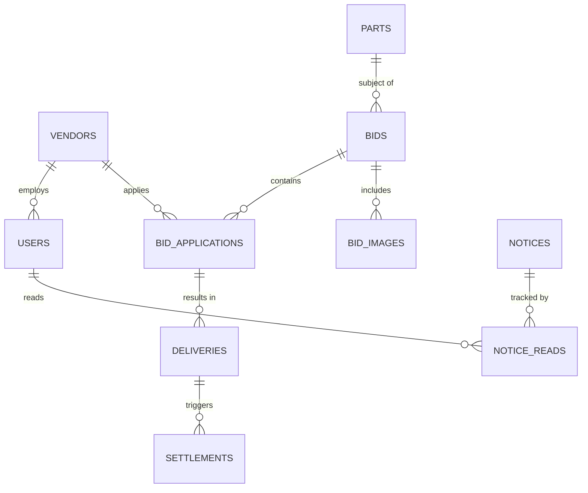

# 데이터 설계서 (Data Design)

## 1. 개요

본 문서는 3조 프로젝트의 데이터베이스 구조와 스키마 명세를 정의한다. 시스템은 MySQL을 기반으로 하며, 현대자동차 SCM(Supply Chain Management) 시스템을 모델로 하여 사용자, 업체, 입찰, 부품, 납품, 정산 등의 정보를 관리한다.

## 2. 데이터베이스 정보

- **DBMS:** MySQL 8.0.x

- **Database Name:** `hmc_scm`

- **Character Set:** `utf8mb4`

- **Collation:** `utf8mb4_unicode_ci`

## 3. 테이블 명세 (Table Specifications)

### 3.1 사용자 관리 (Users)

시스템 접근 권한을 가진 사용자의 정보를 관리한다.

| 컬럼명 | 데이터 타입 | 제약 조건 | 설명 |
| --- | --- | --- | --- |
| `user_id` | `varchar(50)` | `PRIMARY KEY` | 사용자 아이디 |
| `password` | `varchar(100)` | `NOT NULL` | 비밀번호 |
| `user_name` | `varchar(50)` | `NOT NULL` | 사용자 이름 |
| `role` | `varchar(20)` | `NOT NULL` | 권한 (admin/vendor/scm) |
| `company_id` | `int` | `FOREIGN KEY` | 소속 업체 아이디 (`vendors.vendor_id`) |
| `email` | `varchar(100)` |  | 이메일 |
| `phone` | `varchar(30)` |  | 전화번호 |
| `status` | `varchar(20)` | `DEFAULT 'APPROVED'` | 상태 (PENDING/APPROVED/REJECTED) |

### 3.2 업체 관리 (Vendors)

협력 업체 및 관련 정보를 관리한다.

| 테이블명 | 주요 내용 |
| --- | --- |
| `vendors` | 업체 기본 정보 (사업자번호, 대표자, 주소 등) |

### 3.3 입찰 관리 (Bidding)

부품 조달을 위한 입찰 공고 및 응찰 정보를 관리한다.

| 테이블명 | 주요 내용 |
| --- | --- |
| `bids` | 입찰 공고 정보 (부품명, 수량, 마감일 등) |
| `bid_applications` | 업체별 입찰 신청 내역 및 제안 가격 |
| `bid_images` | 입찰 관련 첨부 이미지 파일 정보 |

### 3.4 부품 관리 (Parts)

취급하는 부품의 마스터 정보를 관리한다.

| 테이블명 | 주요 내용 |
| --- | --- |
| `parts` | 부품 기본 정보 (부품번호, 부품명, 규격 등) |
| `parts_db` | 부품 데이터베이스 통합 관리용 |

### 3.5 납품 및 정산 (Delivery & Settlement)

낙찰된 부품의 납품 상태와 대금 정산 정보를 관리한다.

| 테이블명 | 주요 내용 |
| --- | --- |
| `deliveries` | 납품 진행 상태 (출고일, 도착예정일, 상태 등) |
| `settlements` | 대금 지급 및 정산 내역 |

### 3.6 공지 및 알림 (Notice)

시스템 공지사항 및 사용자별 읽음 상태를 관리한다.

| 테이블명 | 주요 내용 |
| --- | --- |
| `notices` | 공지사항 내용 (제목, 본문, 작성자 등) |
| `notice_reads` | 사용자별 공지사항 확인 여부 |
| `evaluations` | 업체 평가 정보 |

## 4. 데이터베이스 관계도 (ERD)

## 5. 저장소 정책

- **데이터 무결성:** 외래 키(Foreign Key) 제약 조건을 통해 테이블 간 참조 무결성을 유지한다.

- **보안:** 사용자 비밀번호는 암호화하여 저장하며, 역할(Role)에 따른 접근 제어를 수행한다.

- **이력 관리:** 주요 상태 변경(입찰 상태, 납품 상태 등)에 대한 이력을 관리한다.

---

**파일명:** `3jo-tajo_DataDesign_v1.0_260602.md`**작성일:** 2026년 06월 02일

